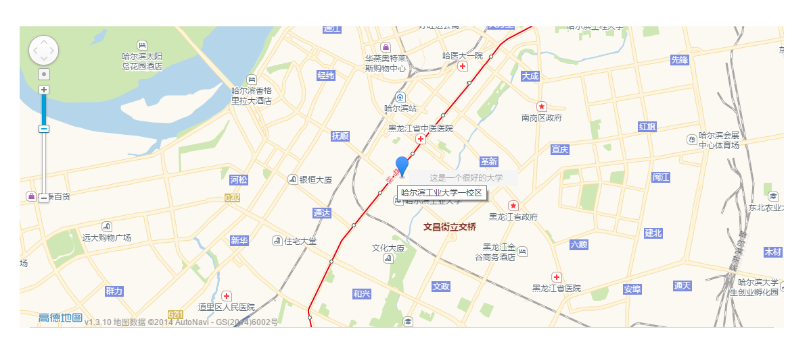

# wp-amaps-plugin
A WordPress Plugin Powered By [Amaps](http://ditu.amap.com/)



## Usage

```
[amaps id='myid' w='100px' h='100px' lon='126.633286' lat='45.747425' address='哈尔滨工业大学一校区' info='这是一个很好的大学']
```
Or
```
[amaps lon='126.633286' lat='45.747425' address='哈尔滨工业大学一校区' info='这是一个很好的大学']
```
Or
```
[amaps address='哈尔滨工业大学一校区' info='这是一个很好的大学']
```
Or
```
[amaps lon='126.633286' lat='45.747425' info='这是一个很好的大学']
```
Or
```
[amaps address='哈尔滨工业大学一校区']
```

with `id`, you can customize style for map

with `w` and `h`, you can customize weight and height for map

## Issues
If you have any question, you can click [Issues](https://github.com/rccoder/wp-amaps-plugin/issues) and open a new Issues.

## Version
1.0
